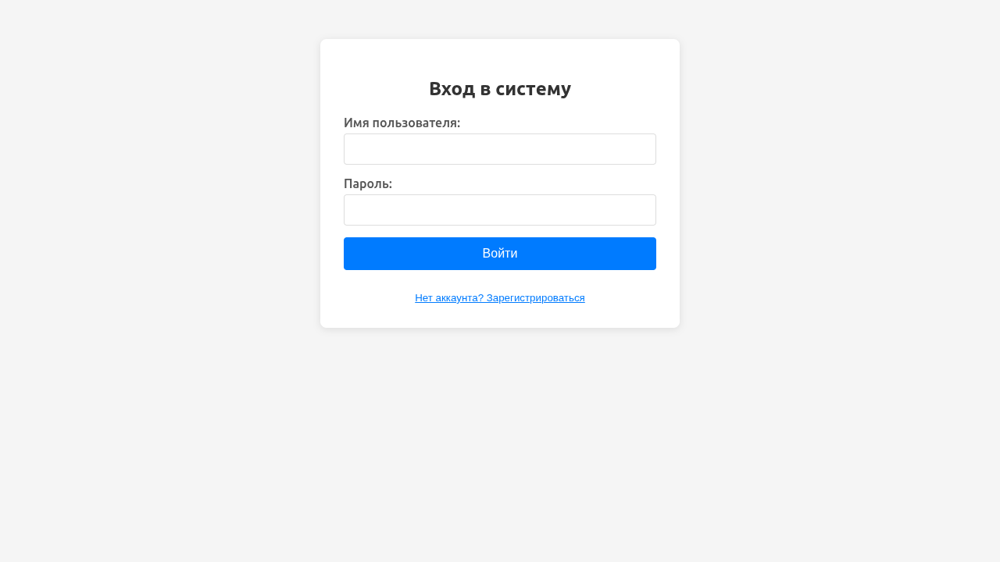
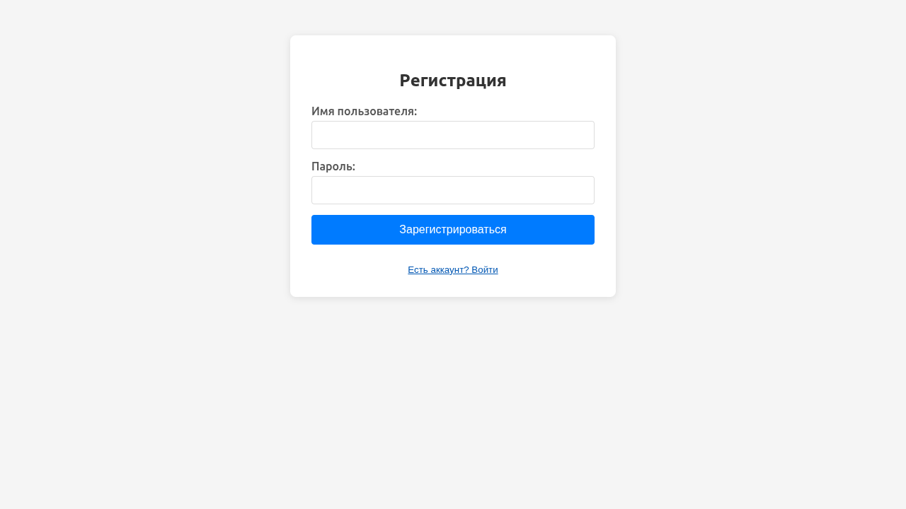
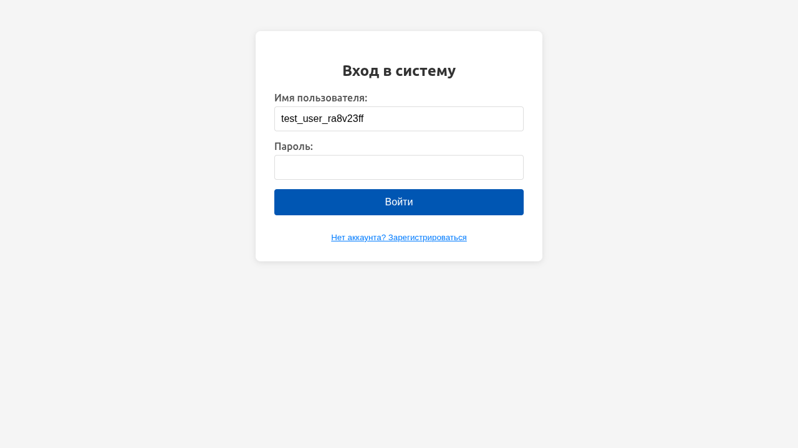
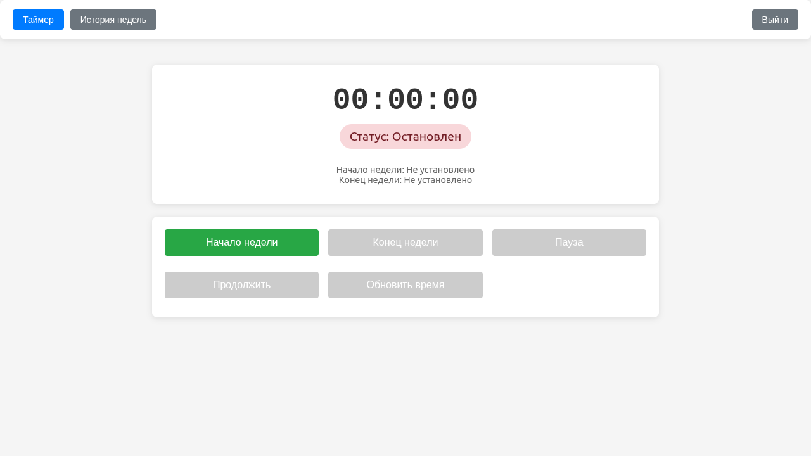
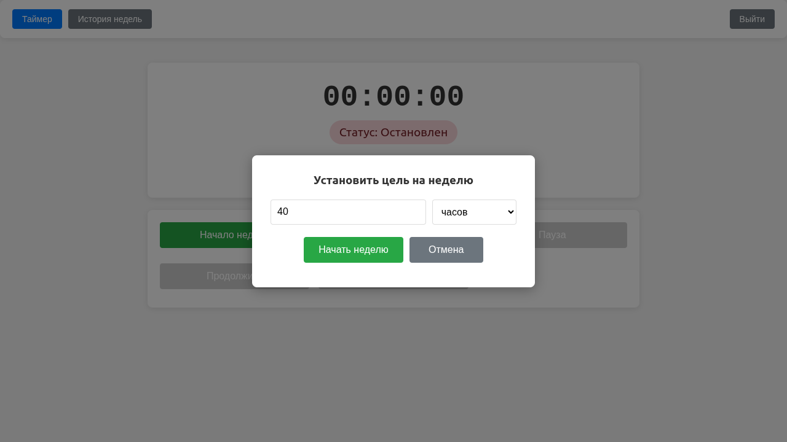
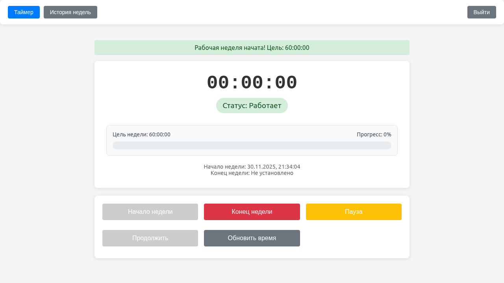
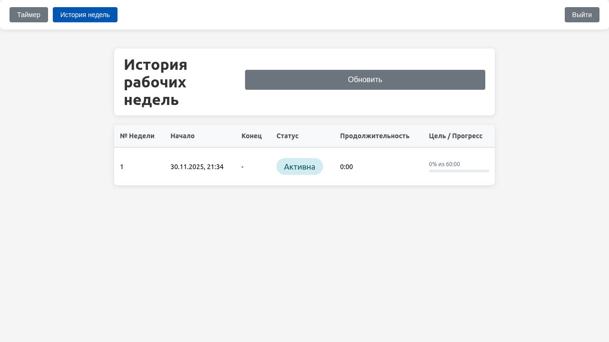
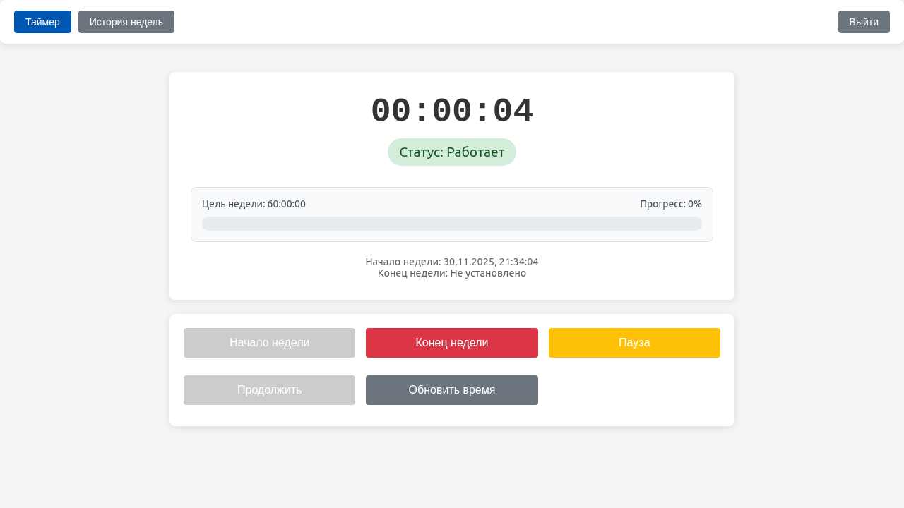

# Отчет по тестам

`Захаркин Богдан`

`367224`

[титульник](title.pdf)

## Описание проекта

[ссылка на ридми](README.md)

## Перечень протестированных пользовательских сценариев

### 1. Регистрация нового пользователя
**Значимость**: Критически важный сценарий, так как без регистрации пользователь не может получить доступ к основному функционалу приложения.

**Шаги теста**:
- Открытие главной страницы
- Переход к форме регистрации
- Заполнение полей логина и пароля
- Отправка формы регистрации
- Проверка успешной регистрации

### 2. Вход в систему
**Значимость**: Основной сценарий доступа к приложению для зарегистрированных пользователей.

**Шаги теста**:
- Заполнение полей логина и пароля
- Отправка формы входа
- Проверка успешной аутентификации
- Проверка доступности основного функционала

### 3. Работа с таймером
**Значимость**: Проверка основного бизнес-функционала приложения - учета рабочего времени.

**Шаги теста**:
- Запуск рабочей недели
- Установка цели по времени
- Проверка работы таймера
- Навигация между страницами
- Проверка истории недель

## Обоснование выбора сценариев

Выбранные сценарии охватывают **критический путь пользователя** - минимальный набор действий, необходимый для получения ценности от приложения:

1. **Регистрация и вход** - обязательные шаги для доступа к системе
2. **Работа с таймером** - основная функциональность приложения

Эти сценарии покрывают **80% основного функционала** и позволяют выявить серьезные проблемы в работе приложения.

## Примеры кода тестов

### Тест регистрации пользователя

```python
async def test_user_registration(self, page):
	await page.goto(self.base_url, wait_until='networkidle')
	await page.wait_for_timeout(3000)

	await self.take_screenshot(page, "01_main_page")
	await self.debug_page_content(page)

	register_btn = page.locator("button:has-text('Нет аккаунта? Зарегистрироваться')").first
	if await register_btn.is_visible(timeout=2000):
		await register_btn.click()
		await page.wait_for_timeout(2000)
		await self.take_screenshot(page, "02_after_register_click")
	else:
		return False
```

### Тест работы таймера

```python
async def test_timer_functionality(self, page):
	logout_btn = page.locator("button:has-text('Выйти')").first
	if not await logout_btn.is_visible(timeout=2000):
		return False

	await self.take_screenshot(page, "06_before_timer")

	start_btn = page.locator("button:has-text('Начало недели')").first
	if await start_btn.is_visible(timeout=2000):
		await start_btn.click()
		await page.wait_for_timeout(2000)
		await self.take_screenshot(page, "07_after_start_click")
	else:
		return False
```

## Результаты выполнения тестов

```bash
Скриншот: 01_main_page.png
Скриншот: 02_after_register_click.png
Скриншот: 03_after_registration.png
Скриншот: 04_login_page.png
Скриншот: 05_after_login.png
Скриншот: 06_before_timer.png
Скриншот: 07_after_start_click.png
Скриншот: 08_timer_started.png
Скриншот: 09_history_page.png
Скриншот: 10_back_to_timer.png
Тест 1 (Регистрация): ПРОЙДЕН
Тест 2 (Вход в систему): ПРОЙДЕН
Тест 3 (Работа таймера): ПРОЙДЕН

ВСЕ ТЕСТЫ УСПЕШНО ПРОЙДЕНЫ!
```

Скриншоты:












## Выводы о качестве пользовательского опыта

### Положительные аспекты
1. **Интуитивный интерфейс** - элементы легко находятся автоматическими тестами
2. **Стабильная работа** - основные функции работают предсказуемо
3. **Четкий workflow** - логичная последовательность действий

### Потенциальные проблемы
1. **Отсутствие явной обратной связи** при регистрации
2. **Недостаточная визуализация** состояния таймера

### Рекомендации по улучшению
1. Добавить явные сообщения об успешной регистрации
2. Улучшить визуальную обратную связь при работе с таймером

## Заключение

E2E-тестирование подтвердило, что **основной функционал приложения Timer Work работает корректно**.
Критический путь пользователя (регистрация → вход → работа с таймером) полностью покрыт и функционирует стабильно.

Приложение готово к использованию, однако рекомендуется обратить внимание на улучшение пользовательского опыта через
более явную обратную связь и улучшение доступности интерфейса.
